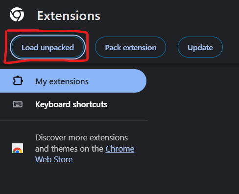
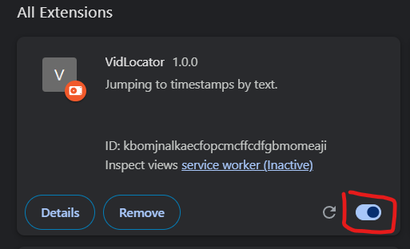
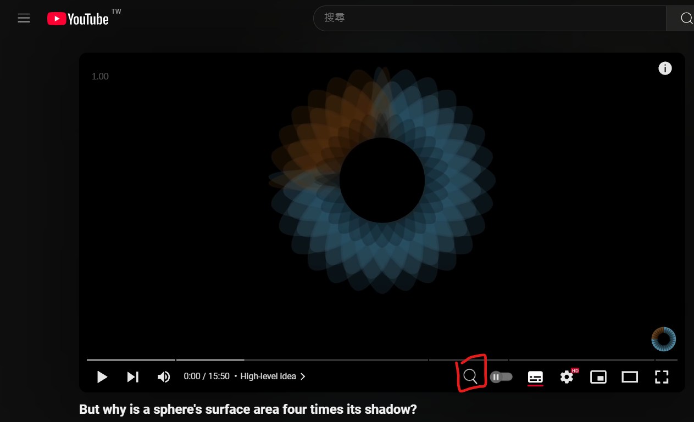
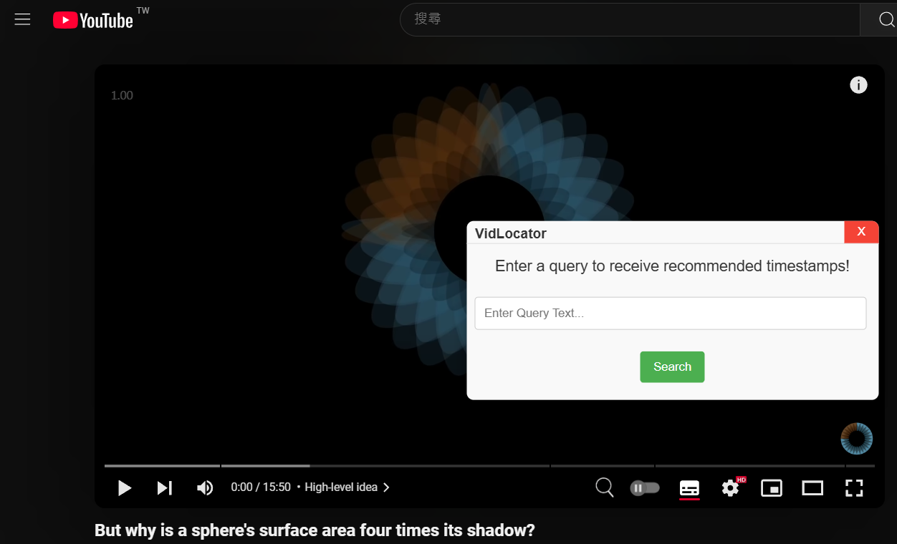
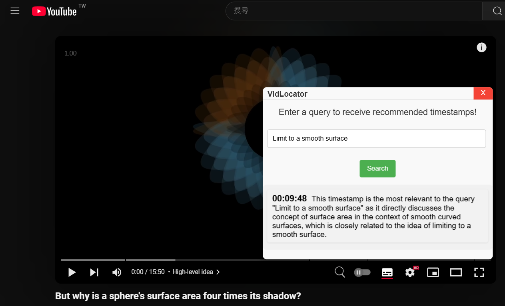
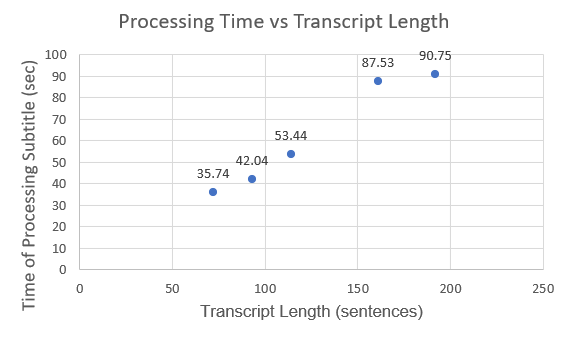

# VidLocator: A Tool for Locating Video Timestamps Based on Text

VidLocator is a Chrome extension that allows users to retrieve recommended timestamps by inputting text queries on YouTube. Current video platforms lack efficient tools for finding exact timestamps based on user queries. This project addresses this challenge by leveraging Large Language Models to extract precise timestamps from videos. Users can input text queries, and the system will identify the corresponding moments in the video where the topic is discussed. By automating this process, the project significantly improves how users retrieve information from video content, especially for those who need quick access to or a review of specific sections.

## Usage

### Run Server

1. `cd backend`
2. Setup groq API key in `.env`
   ```
   PUBLIC_API_KEY=<API key>
   ```
3. Install dependencies packages in `requirements.txt`
4. `python -m flask run`

Then two API endpoints should be exposed on host

- **POST** `/store_video_data`

  - Body example
    ```json
    {
        "youtube_url": "https://www.youtube.com/watch?v=wjZofJX0v4M&ab_channel=3Blue1Brown"
    }
    ```
- **POST `/query_timestamp`**

  - Body example
    ```json
    {
        "query_text": "what is the basic knowledge of deep learning",
        "youtube_url": "https://www.youtube.com/watch?v=wjZofJX0v4M&ab_channel=3Blue1Brown"
    }
    ```

### Load Extension

Load the `extension` folder in chrome's extension management page `chrome://extensions/`

This can be done by click the "Load unpacked" on the upper left corner of the page.



Then make sure VidLocator has been turned on.



### Use Extension

* Note that it takes a while to process and store video data in the database if the video has not yet been accessed by VidLocator.
* Once the data is processed, the user can click the search button on the progress bar of the YouTube video.
  * 
* The user can type a query text and select the recommended timestamp that matches their needs.
  * 
  * 

### Architecture

The project involves two main components:

* A Chrome browser extension serving as the frontend
* A backend server responsible for subtitle extraction, speech-to-text processing, and LLM query handling.

#### Chrome Browser Extension

A browser extension embedded in the YouTube video page that displays a panel for querying timestamps based on user-input text and showing suggested timestamps.

* **Techniques**
  * Manifest V3 with plain JavaScript

#### Backend Server

The server is the core component of VidLocator, integrating the following functions:

- **Subtitle Retrieval**
  Fetches YouTube video subtitles or uses speech-to-text (STT) to transcribe videos when subtitles are unavailable.
- **Query Processing**
  Utilizes LLM-based techniques, such as RAG, to return recommended timestamps with brief explanations.
- **API Endpoints**
  Offers two RESTful APIs for interaction with the browser extension.

##### Workflow of Server

1. Aquire subtitle for the video.
   a. If subtitles are available, the server retrieves the transcript directly using the `youtube_transcript_api` package.
   b. If subtitles are unavailable, the server downloads the audio using the `yt_dlp` package and converts it into text using the local `faster-whisper` library.
2. The transcipt will be processed so that each timestamp corresponds to a single sentence.
3. Use `ollama` locally to embed each sentence and store the embedding with the corresponding timestamp key in `chromadb`.
4. Store the video's metadata, such as title and description fetched via `yt_dlp`, in `chromadb` as well.
5. Utilize the LLM service from `groq` to generate RAG keywords based on the user's query text and the video's metadata.
6. Use these keywords and the query text to query `chromadb`, retrieving a list of timestamp candidates.
7. Process the timestamp candidates to ensure that for a group of closely spaced timestamps, only the first one is retained. This simplifies the results and avoids redundant or overly frequent suggestions.
8. Finally, use the LLM service from `groq` again to select the most reasonable timestamps with brief explanations to return to the user. The prompt includes the metadata and timestamp candidates.

## Experiments

### Time Efficiency

#### Subtitle Unavailable vs Available

Goal: Test the execuation time of **store_video_data** between cases where subtitles are unavailable or available.

Test Video ID: fNk_zzaMoSs

Note: For convenience, I mock the unavailable case by forcing the system not to fetch the subtitle directly via the API.

- Length: 9 min 51 sec
- Transcript: 72 sentences
- |             | Total Time (sec) | Audio Download | transcription |
  | ----------- | ---------------- | -------------- | ------------- |
  | Available   | 61.05            | N/A            | N/A           |
  | Unavailable | 149.79           | 26.21          | 48.79         |

The results show that time efficiency is significantly affected when subtitles are unavailable.

#### Transcript Length

Goal: Test the execuation time of **store_video_data** with different transcript length(in terms of sentences).

| Video Id    | Transcript Length | Total Time (sec) | Time of Processing Subtitle (sec) |
| ----------- | ----------------- | ---------------- | --------------------------------- |
| r6sGWTCMz2k | 161               | 91.73            | 87.53                             |
| fNk_zzaMoSs | 72                | 64.37            | 35.74                             |
| bBC-nXj3Ng4 | 192               | 94.61            | 90.75                             |
| OkmNXy7er84 | 93                | 44.93            | 42.04                             |
| GNcFjFmqEc8 | 114               | 57.45            | 53.44                             |



In this set of experiments, we can observe that processing time has a positive relationship with transcript length.

## Conclusion

VidLocator is a search engine for video subtitle.

### Limitation

* Each embedding record represents one sentence. If the user's query involves multi-sentence context, the results may not align with the user's expectations.
* The processing time for STT is significant, especially for longer videos, leading to a poor user experience when subtitle data for a video has not yet been stored in the system.
* VidLocator does not account for the visual data in videos.
